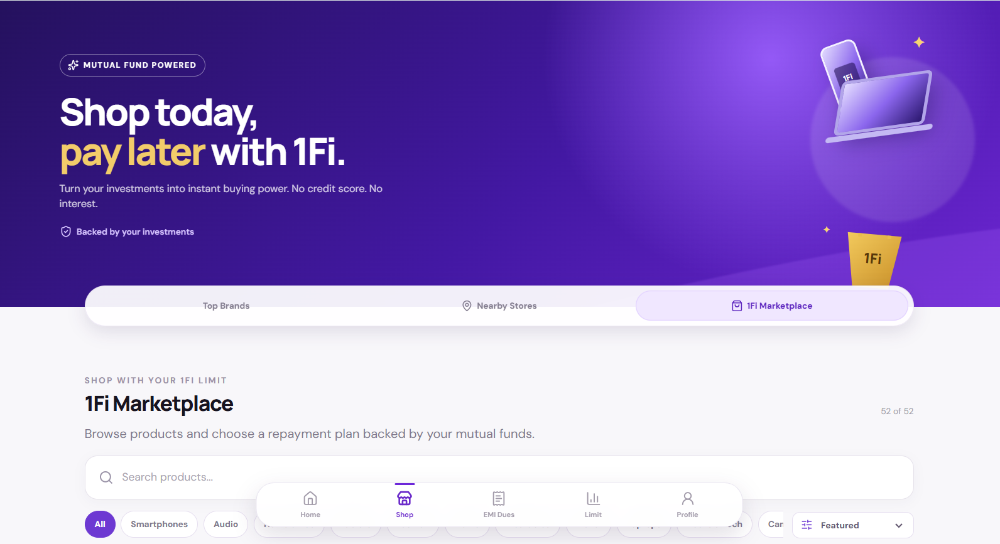
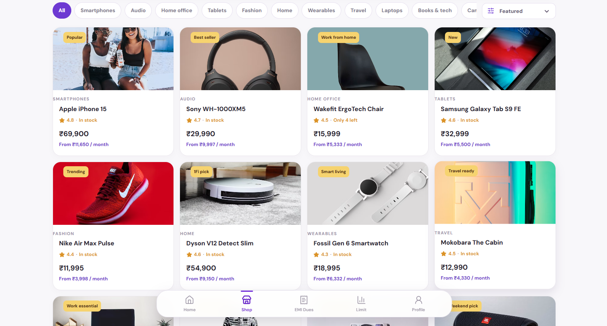

# 1Fi Marketplace

A responsive 1Fi Marketplace experience for browsing products and selecting mutual-fund-backed EMI plans.

## Screenshots

<p align="center">
  
</p>

<p align="center">
  
</p>

<p align="center">
  
</p>

## Features

- Full-width responsive Shop experience for desktop and mobile.
- Top Brands, Nearby Stores, and 1Fi Marketplace Shop sections.
- 52 mock marketplace products across technology, audio, fashion, home, kitchen, travel, jewellery, and lifestyle.
- Product images, names, pricing, badges, ratings, stock status, and relevant details.
- Product variant selection.
- Search by product name, category, and description.
- Category filters and price/rating sorting.
- Multiple no-cost EMI plans for every marketplace product.
- Product detail modal with selected monthly payment summary.
- Proceed with EMI confirmation flow.
- Loading, empty-search, and responsive states.
- Mock API data separated from the React UI.

## Tech Stack

- React 19
- Vite
- Express
- Lucide React
- Oxlint
- Optional MongoDB connection through `MONGO_URI`

## Project Structure

```text
client/              React and Vite frontend
  src/App.jsx        Main application and marketplace UI
  src/App.css        Responsive application styles
server/              Express mock API
  server.js          Dashboard, stores, products, dues, limit, and profile data
package.json         Workspace scripts
```

## Requirements

- Node.js 18 or newer
- npm

## Installation

From the repository root:

```bash
npm install
```

## Development

Start both the API and frontend:

```bash
npm run dev
```

The application runs at:

- Frontend: http://localhost:5173
- API: http://localhost:5000

The server uses in-memory mock data when `MONGO_URI` is not provided.

## Available Scripts

```bash
npm run dev       # Start the Express API and Vite frontend
npm run build     # Build the frontend for production
npm run start     # Start the Express server
```

Client-only checks can be run with:

```bash
npm run build --workspace client
npm run lint --workspace client
```

## API Endpoints

- `GET /api/health` - API health check
- `GET /api/dashboard` - Dashboard data including marketplace products
- `GET /api/marketplace` - Marketplace product catalog
- `GET /api/stores` - Online and nearby store partners
- `GET /api/dues` - EMI dues
- `GET /api/limit` - Investment-backed spending limit
- `GET /api/profile` - User profile

## Marketplace Flow

1. Open the Shop section.
2. Select `1Fi Marketplace`.
3. Search, filter, or sort products.
4. Select a product card.
5. Choose a product variant and EMI plan.
6. Review the monthly EMI amount.
7. Select `Proceed with EMI`.
8. Review the confirmation and open EMI dues.

The checkout confirmation is currently a mock flow. A production integration can replace the confirmation handler with a real checkout or order API without changing the product browsing model.
